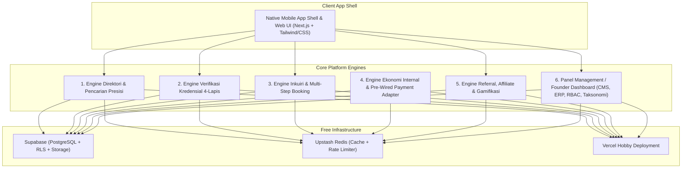

# Master Architecture & Complete Implementation Plan — SEMESTA ISLAM (Archive)

> [!IMPORTANT]
> Dokumen ini disalin dan diarsipkan ke dalam `./docs/archive/` sebagai referensi pelaksanaan bertahap.

---

## 1. Ringkasan Visi & Cakupan MVP Berinfrastruktur 100% Free Tier

- **Target Inisiasi**: Membangun fondasi platform SEMESTA ISLAM yang matang, scalable, dan modular untuk penetrasi pasar, pembentukan brand terpercaya (*trusted brand building*), dan entry point pengguna.
- **Infrastruktur 100% Free Tier**:
  - **Frontend & Serverless**: Vercel Hobby Plan (Next.js App Router, Edge Functions).
  - **Database & Auth**: Supabase Free Tier (PostgreSQL, Supabase Auth dengan Row Level Security / RLS, Storage Buckets).
  - **Caching & Rate Limiting**: Upstash Redis Free Tier (`@upstash/redis`, `@upstash/ratelimit`).
  - **Source Control & CI/CD**: GitHub Free.
  - **Email Transaksional**: Resend / Brevo Free Tier (100–300 email/hari gratis).

---

## 2. Arsitektur Komponen Utama Sistem Utuh



---

## 3. Rincian Modul & Fitur Terintegrasi

### A. Engine Direktori, Pencarian & Profil Pendidik
- **Pencarian Real-Time**: Pencarian berdasarkan nama ustaz, gelar, almamater, lokasi, dan bidang keilmuan.
- **Filter Presisi**: Penyaringan metode (Online vs Tatap Muka), kategori keahlian, dan pengurutan rating/ulasan.
- **Tabbed Profile Sheet**: Profil terperinci berisi Bio, Silsilah Sanad Keilmuan, Ijazah Almamater, dan Ulasan Terverifikasi.

### B. Engine Verifikasi Kredensial 4-Lapis & Tools Integrasi
1. **Layer 1 (Identitas Resmi)**: Validasi KTP/Paspor menggunakan `tesseract.js` (client-side OCR gratis) + Supabase Private Storage Bucket dengan signed URL terenkripsi.
2. **Layer 2 (Sanad & Ijazah)**: Pengunggahan ijazah PDF/Gambar, ekstraksi metadata via `pdf-lib`, dan pembuatan **Digital Fingerprint SHA-256** untuk menjamin keaslian ijazah + Dashboard Lajnah Sanad Reviewer.
3. **Layer 3 (Rekomendasi Ulama/Ormas)**: Konfirmasi otomatis via email transaksional gratis (**Resend Free Tier** / **Brevo Free Tier**) menggunakan token verifikasi satu-klik.
4. **Layer 4 (Audit Etika & Track Record)**: Algoritma kalkulasi skor etika berdasarkan tingkat respon pesan, ulasan pembelajar terverifikasi, dan kepatuhan kode etik.

### C. Engine Ekonomi Internal, Business/Marketing & Gamifikasi (Siap Payment Gateway)
- **Tanpa Transaksi Uang Tunai di MVP**: Menggunakan *Abstraksi Payment Adapter* (`PaymentGatewayAdapter` dengan `MockPaymentGatewayAdapter`). Saat Payment Gateway resmi (Midtrans/Xendit/Stripe) dihubungkan nanti, sistem langsung sinkron tanpa perombakan arsitektur.
- **Buku Besar Internal (Virtual Ledger)**: Pencatatan poin (`LearnerPoints`), diskon (`VoucherCredits`), insentif (`RewardToken`), dan simulasi komisi (`FeeLedgerEntry`).
- **Sistem Referral & Affiliate Engine**: Kode referral unik (`ReferralCode`, `ReferralConversion`), pelacakan pendaftaran/booking, komisi virtual, dan *Leaderboard Ambassador*.
- **Gamifikasi**: *Daily Learning Streak*, *Trust Score & Badges* pendidik, serta *Khatam Badges*.

### D. Panel Management / Founder Dashboard
1. **CMS Management**: Kontrol landing page, artikel, panduan parenting Islam, FAQ, dan dokumen legal/kebijakan.
2. **ERP & Financial Oversight**: Pengawasan ledger internal, simulasi pendapatan, dan skema bagi hasil/komisi.
3. **RBAC & Role Permissions**: Matriks hak akses terperinci (`FOUNDER_ADMIN`, `LAJNAH_VERIFIER`, `INSTITUTION_ADMIN`, `EDUCATOR`, `LEARNER`) berbasis Supabase RLS.
4. **Badge & Credential Verification Pipeline**: Antrean peninjauan berkas 4-lapis & penerbitan *Verified Badges*.
5. **Taxonomy Engine**: Hirarki Kategori Keilmuan (*Tahsin*, *Fiqh*, *Aqidah*, *Hadits*, *Bahasa Arab*, *Parenting*), Mazhab, Sanad Tree, & Geografi Lokasi.

---

## 4. Spesifikasi Sumber/Resource OSS & Integrasi Free-Tier

```text
[FRAMEWORK & APP]
 ├── Next.js App Router (TypeScript, React 19) -------> Vercel Hobby Free Tier
 ├── Vanilla CSS / Design Tokens ---------------------> Custom System (Stoic UX, Dark Mode)
 ├── Lucide Icons (lucide-react) ---------------------> Free Open Source Icons
 ├── Vaul (vaul) -------------------------------------> Native Bottom Sheet Drawer Engine
 └── Framer Motion (framer-motion) -------------------> Spring Physics Animation Engine

[DATA, AUTH & CACHE]
 ├── Supabase PostgreSQL Free Tier -------------------> Database Relasional & RLS Security
 ├── Supabase Auth (@supabase/supabase-js) ---------> Email Magic Link, OAuth, User Sessions
 ├── Supabase Storage (Public & Private Buckets) ----> Avatars (Public) & KTP/Sanad PDF (Private)
 ├── Prisma ORM (@prisma/client, prisma) ------------> Typesafe DB Client & Migrations
 └── Upstash Redis Free Tier (@upstash/redis) --------> Rate Limiting API & Cache Taksonomi

[VERIFICATION & NOTIFICATION]
 ├── Tesseract.js (tesseract.js) --------------------> Client-side OCR KTP/Identitas
 ├── PDF-Lib (pdf-lib) ------------------------------> Parsing & Hashing Berkas Ijazah PDF
 └── Resend / Brevo Free Tier -----------------------> Transaksional Email (100-300 email/hari free)
```

---

## 5. Roadmap Eksekusi Ber-Milestone

### Milestone 1: Repositori Codebase & Skema Database Prisma
- Inisialisasi proyek Next.js App Router dengan TypeScript & Supabase Client.
- Penyusunan berkas `schema.prisma` mencakup seluruh entitas identity, verification, taxonomy, referral, dan economic ledger.
- Migrasi database awal ke Supabase PostgreSQL Free Tier.

### Milestone 2: Panel Management / Founder Dashboard
- Pembangunan antarmuka Founder Dashboard (CMS, Taxonomy Engine, RBAC Management).
- Modul Pipeline Verifikasi 4-Lapis untuk Lajnah Reviewer (OCR KTP & Hashing Ijazah).

### Milestone 3: Referral Engine & Gamifikasi
- Pembangunan generator kode referral, tracking conversion link, dan insentif `LearnerPoints`.
- Sistem kalkulasi *Trust Score* & *Daily Learning Streak*.

### Milestone 4: Integration & Mobile App Shell Enhancement
- Menghubungkan antarmuka publik (`index.html`, `index.css`, `app.js`) dengan API Routes Next.js & Supabase DB.
- Pengujian multi-step booking request dan pencatatan buku besar internal.

### Milestone 5: Security Audit, Testing & Launch
- Audit Supabase RLS Policies untuk proteksi dokumen privat KTP/Sanad.
- Rate limiting API Routes via Upstash Redis.
- End-to-end testing dari pendaftaran Ustaz hingga persetujuan Founder.
