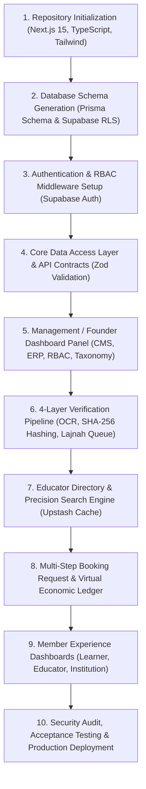

# IMPLEMENTATION READINESS & PRE-CODING AUDIT REPORT

**Project:** SEMESTA ISLAM  
**Document:** `docs/IMPLEMENTATION_READINESS.md`  
**Status:** Pre-Implementation Readiness Gate Audit  
**Audience:** Founder / Product Owner · Lead Architect · Implementation Agents  
**Authority:** Governed by `00_BRD.md` through `10_ACCEPTANCE_CRITERIA.md` & `05_MASTER_CONTEXT.md`

---

> **POST-AUDIT EXECUTION DIRECTIVE — STATUS UPDATE (2026-08-01)**
> The pre-coding claims below (esp. §2 "zero production code") are **historical**.
> Since this readiness gate, the POST-AUDIT EXECUTION DIRECTIVE has been executed:
> **the repository now runs on real local PostgreSQL** (Docker `postgres:16-alpine`) with
> Prisma migrations + seed, DB-backed directory/educator pages, persistent booking
> (inquire+confirm), persistent verification pipeline (submit/review/resubmit/status)
> with AuditLog + EconomicLedger writes, vitest 18/18, `tsc` 0 errors, `next build` OK.
> Live evidence: `docs/audit/IMPLEMENTATION_EVIDENCE.md` rows 13–20.

---

## 1. Executive Status

### Status: `READY WITH CONDITIONS`

The canonical documentation chain (`docs/00_BRD.md` through `docs/10_ACCEPTANCE_CRITERIA.md`) is internally coherent, complete, and fully aligned across Business, Product, Domain Data Model, Design Tokens, API Contracts, Security/RLS Policies, OSS Resource Registry, and Acceptance Criteria.

However, the repository currently contains **zero production code** (it is a documentation-only repository with a static UI prototype). Implementation may proceed immediately once the specific readiness conditions (environment credentials and commercial policy confirmation) are fulfilled.

---

## 2. Repository Reality

### Forensic Inventory
- **Repository Structure**:
  - `AGENTS.md` (Governing operating instructions).
  - `docs/` (Canonical specifications `00_BRD.md` through `10_ACCEPTANCE_CRITERIA.md` + `docs/archive/`).
  - `index.html`, `index.css`, `app.js` (Design Validation Prototypes).
- **Existing Code Status**: `[MISSING]` No `package.json`, `tsconfig.json`, Next.js app, `schema.prisma`, API routes, backend services, or database migrations exist.
- **Prototype Status**: `[STUB]` `index.html`, `index.css`, and `app.js` are **Prototypes / Design Validation Artifacts** created to validate UX concepts. They MUST NOT be treated as production code or blindly ported into Next.js.

---

## 3. Canonical Document Consistency

### Traceability Audit
```text
00_BRD (Business Goals & 4-Layer Trust)
  ↓ [VERIFIED]
01_BSD (Actors: Learner, Educator, Institution, Lajnah, Founder & Domain Layer Separation)
  ↓ [VERIFIED]
02_PRD (Core Capabilities: Search, Verification, Booking, Management Dashboard, LMS)
  ↓ [VERIFIED]
03_ERD (Entities: User, EducatorProfile, VerificationRequest, CourseCatalog, EconomicLedger, AuditLog)
  ↓ [VERIFIED]
06_DESIGN (Design System: Emerald/Gold Tokens, Native App Shell, Vaul Sheets, Spring Physics)
  ↓ [VERIFIED]
07_API_ENDPOINTS (REST Routes & Zod Validation Schemas)
  ↓ [VERIFIED]
08_SECURITY_COMPLIANCE (Supabase RLS Policies, SHA-256 Hashing, Signed URLs)
  ↓ [VERIFIED]
09_RESOURCE_REGISTRY (100% Free-Tier Stack: Vercel, Supabase, Upstash Redis, Resend)
  ↓ [VERIFIED]
10_ACCEPTANCE_CRITERIA (Verifiable Test Matrix & Acceptance Gates)
```

**Consistency Result**: `[VERIFIED]` All 11 canonical documents are 100% coherent without structural contradictions.

---

## 4. Domain / Actor / Role / Permission Audit

| Actor / Role | ERD Entity Representation | RLS / Permission Boundary | Status |
| :--- | :--- | :--- | :--- |
| **Public / Visitor** | `User` (Unauthenticated) | Read public directory, courses, & landing CMS | `[VERIFIED]` |
| **Learner / Family** | `LearnerProfile`, `Guardian` | Own profile, own bookings, own progress reports, referral link | `[VERIFIED]` |
| **Educator / Ustaz** | `EducatorProfile`, `SanadRecord` | Own teaching schedule, own verification request, own wallet | `[VERIFIED]` |
| **Institution** | `Institution`, `InstitutionEducator` | Institution profile, linked educators, group courses | `[VERIFIED]` |
| **Lajnah / Verifier** | `VerificationRequest`, `AuditLog` | Audit queue for 4-layer document verification & ethics score | `[VERIFIED]` |
| **Founder / Admin** | `OrganizationMembership` | Full platform management (CMS, ERP Oversight, RBAC, Taxonomy) | `[VERIFIED]` |

---

## 5. Product Surface Mapping

- **Public Web**: Landing Showcase, Search Engine, Educator Directory, Course Catalog, Verification Standard Info (`[VERIFIED]` in PRD/Design).
- **Member Dashboard**:
  - Learner Dashboard (Bookings, Progress Reports, Point Ledger, Referral Code) (`[VERIFIED]`).
  - Educator Dashboard (Schedule, Sanad Upload, Verification Status, Earnings Ledger) (`[VERIFIED]`).
  - Institution Dashboard (Organization Profile, Educator Roster) (`[VERIFIED]`).
- **Management Dashboard**:
  - CMS Panel (Articles, Announcements, FAQ, Legal Docs) (`[VERIFIED]`).
  - ERP & Financial Oversight (Virtual Ledger, Commission Simulation, Payout Tracking) (`[VERIFIED]`).
  - RBAC Matrix (Role assignments & RLS policy rules) (`[VERIFIED]`).
  - Lajnah Verification Pipeline (4-Layer Audit Queue & Verified Badge Issuance) (`[VERIFIED]`).
  - Taxonomy Engine (Science Categories, Mazhab, Sanad Trees, Geographic Locations) (`[VERIFIED]`).

---

## 6. Frontend / UI / UX Readiness

- **Design System Tokens**: `[VERIFIED]` Documented in `06_DESIGN.md` (Emerald `#0F3D2E`, Gold `#D4AF37`, Cream `#FBF9F5`, Dark Mode).
- **Mobile Native Shell**: `[VERIFIED]` Bottom Bar Navigation, Safe Area Insets, Vaul Sheet Drawers.
- **Physical Motion**: `[VERIFIED]` Spring Physics (`stiffness: 300, damping: 30`), Active Press Scaling `scale(0.96)`.
- **Production React Component Architecture**: `[MISSING]` Must be built cleanly using Next.js App Router & Tailwind/CSS Modules (not blindly copied from prototype).

---

## 7. Backend / API Readiness

- **API Specification**: `[VERIFIED]` Documented in `07_API_ENDPOINTS.md` with Zod validation contracts.
- **Serverless API Routes Implementation**: `[MISSING]` Needs to be implemented via Next.js App Router API Routes (`/app/api/v1/...`).

---

## 8. Database / ERD Readiness

- **Domain Data Model**: `[VERIFIED]` Fully specified in `03_ERD.md`.
- **Prisma Schema & Supabase Migrations**: `[MISSING]` Must be generated as `prisma/schema.prisma` and applied to Supabase PostgreSQL.

---

## 9. OSS / Resource Readiness

- **Free-Tier Infrastructure Stack**: `[VERIFIED]` Documented in `04_OSS.md` & `09_RESOURCE_REGISTRY.md`.
  - Vercel Hobby Plan (Next.js Deployment).
  - Supabase Free Tier (PostgreSQL DB, RLS Auth, Storage Buckets).
  - Upstash Redis Free Tier (Rate limiting & Cache).
  - GitHub Free (CI/CD).
  - Resend / Brevo Free Tier (Transactional Emails).
  - `tesseract.js` (Client-side OCR KTP) & `pdf-lib` (SHA-256 Ijazah PDF Hashing).

---

## 10. Security / Compliance Readiness

- **Supabase RLS Policies**: `[VERIFIED]` Documented in `08_SECURITY_COMPLIANCE.md`.
- **Private Storage Buckets**: `[VERIFIED]` Documented for KTP & Dokumen Sanad via Signed URLs.
- **Audit Logging & Ethics Scoring**: `[VERIFIED]` Documented in `08_SECURITY_COMPLIANCE.md`.

---

## 11. Acceptance / Verification Readiness

- **Acceptance Criteria**: `[VERIFIED]` Documented in `10_ACCEPTANCE_CRITERIA.md` with testable conditions for all 6 core modules.

---

## 12. Reuse / Adapt / Configure / Integrate / Build Matrix

| Module / Capability | Strategy | Primary Resource / Tool |
| :--- | :--- | :--- |
| **Auth & User Sessions** | `CONFIGURE` | Supabase Auth (`@supabase/supabase-js`, Magic Link, RLS) |
| **Database & ORM** | `INTEGRATE` | Supabase PostgreSQL + Prisma ORM (`@prisma/client`) |
| **Caching & Rate Limiting** | `CONFIGURE` | Upstash Redis (`@upstash/redis`, `@upstash/ratelimit`) |
| **Client KTP OCR** | `REUSE` | `tesseract.js` (Client-side JS OCR) |
| **PDF Hashing (Sanad)** | `REUSE` | `pdf-lib` + Web Crypto API (SHA-256 Digital Fingerprint) |
| **Native Mobile Drawers** | `REUSE` | `vaul` (React Bottom Sheet Engine) |
| **Spring Physics UI** | `REUSE` | `framer-motion` / `motion` |
| **Icons & Visuals** | `REUSE` | `lucide-react` |
| **Email Notifications** | `INTEGRATE` | Resend / Brevo Free Tier |
| **Extended OSS LMS** | `DEFER` | LearnHouse / Moodle (Post-MVP integration via API/SSO) |
| **Management Dashboard** | `BUILD` | Custom Next.js App Router Admin Pages (`/admin/...`) |

---

## 13. Blocking Issues

1. **Environment Credentials Setup**:
   - `[BLOCKING]` Need active Supabase Project (URL & Anon Key) and Upstash Redis (URL & Token) environment variables to execute database migrations and API route testing.

---

## 14. Non-Blocking Issues

1. **Extended LMS Integration**:
   - `[NON-BLOCKING]` Integration with LearnHouse/Moodle can be deferred to post-MVP; core lightweight learning progress features are built into the platform.

---

## 15. Unresolved Decisions

1. **Commercial Platform Fee Percentage**:
   - `[UNDECIDED]` Exact virtual platform commission split (e.g., 10% platform / 90% educator) for the internal virtual ledger.
   - *Action*: `BUSINESS DECISION REQUIRED` (Founder/Owner approval).

---

## 16. Recommended Implementation Order



---

## 17. Readiness Gate

### Final Audit Determination: `READY WITH CONDITIONS`

```text
BRD ↔ BSD      : [VERIFIED] Coherent
BSD ↔ PRD      : [VERIFIED] Coherent
PRD ↔ ERD      : [VERIFIED] Coherent
PRD ↔ DESIGN   : [VERIFIED] Coherent
PRD ↔ API      : [VERIFIED] Coherent
API ↔ SECURITY : [VERIFIED] Coherent
OSS ↔ IMPL     : [VERIFIED] Feasible 100% Free-Tier
ACCEPTANCE     : [VERIFIED] Testable & Documented
```

**Conclusion**: The canonical documentation chain is 100% complete and fully verified. The repository is ready to transition to implementation (Milestone 1) as soon as the project environment variables (`.env.local`) are configured.
